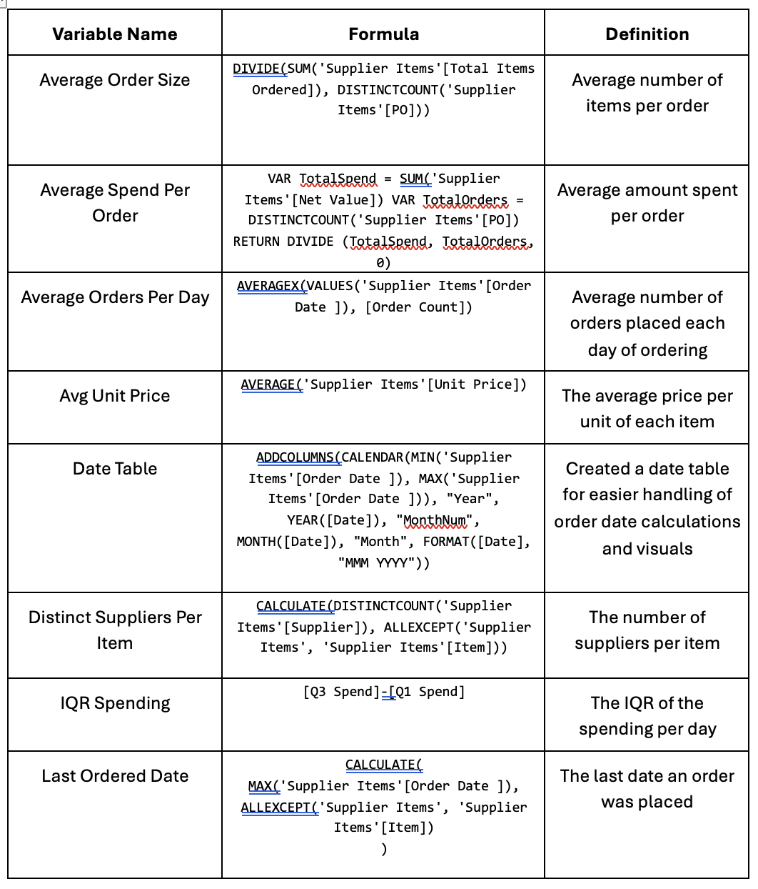
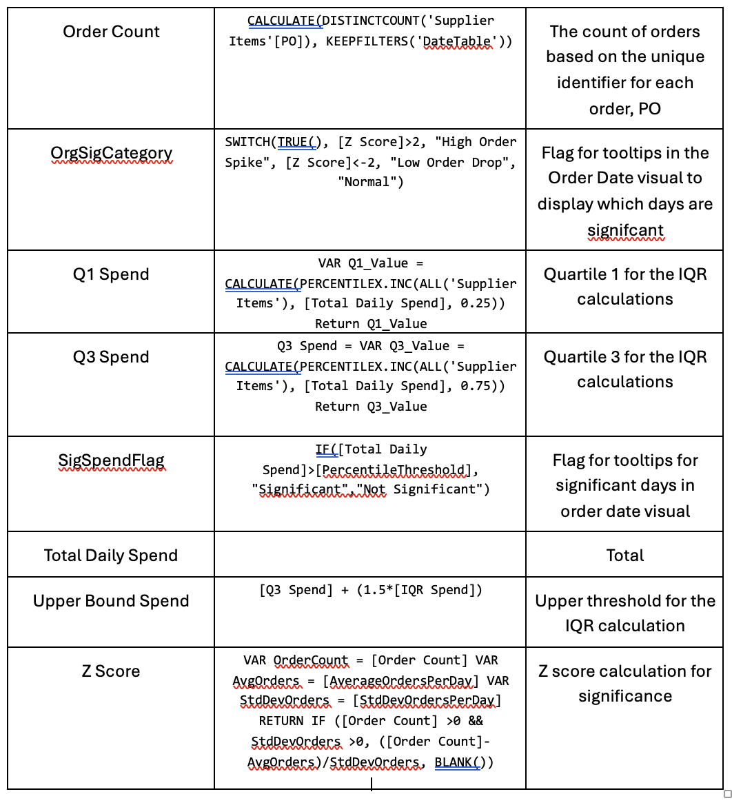
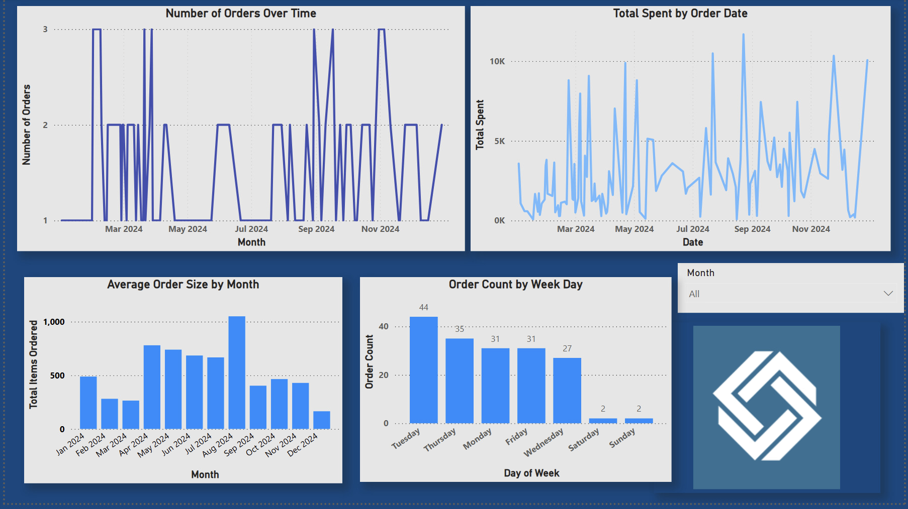
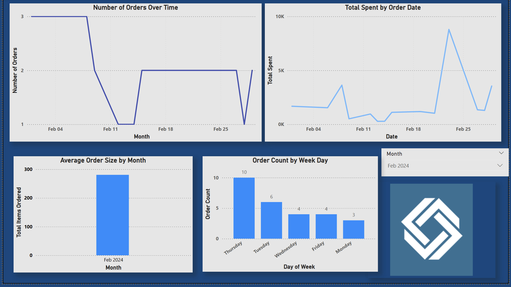
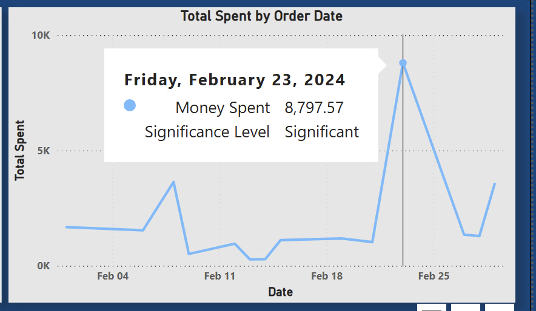
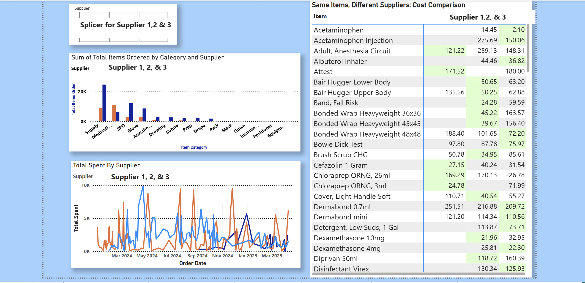
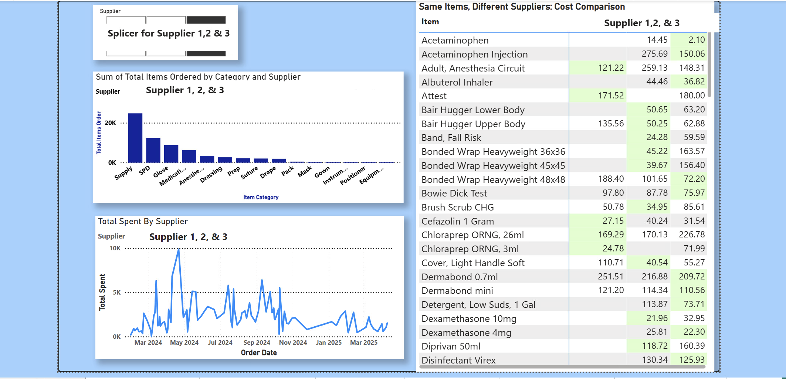
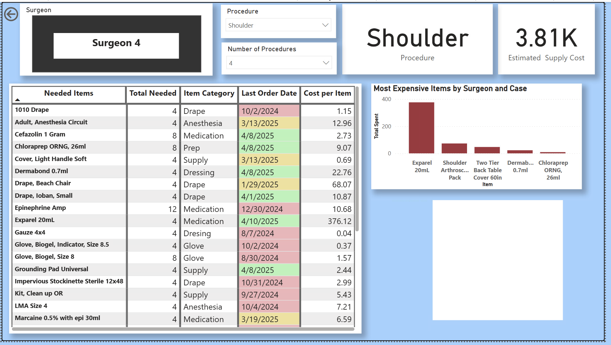
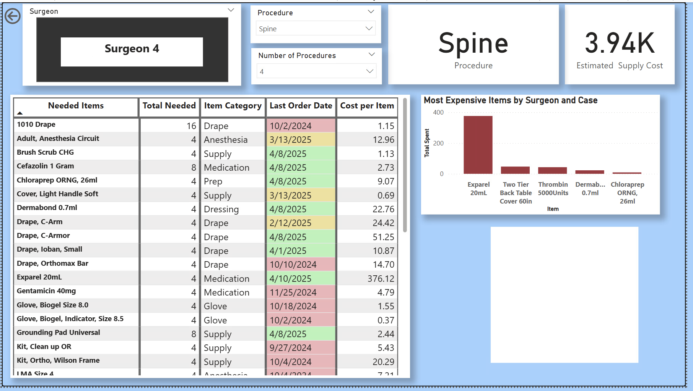

## Ordering Data Dashboard Creation

  

The hospital provided one large excel file with several worksheets in it related to supplier data. This data was uploaded into Power BI for the majority of the data cleaning and exploration 
process. Overall, the data was very clean and required little editing. To create the desired visuals in PowerBI, several new variables were created. 

## Variable Creation and Management 🌸

Below is a table of the newly created variables in PowerBI along with the DAX code used to create them. 

  

  

## Order Date Page 📆
---
This page contains visuals for number of orders over time, total spent per order over time, average order size by month, and count of orders per day of week. It has a slicer option to filter 
the visual by month or year. 

  

The Order Date page without filters 

  

The Order Date page with a filter for Feb 

**Significance Testing 🏁**

Because the hospital was curious about if there were any trends in the ordering where there were days with a significant amount of spending or a significant amount of orders being placed. 
If the tool flagged a day as beign significant, the hospital could go back and investigate what took place that would cause a signifcant uptick in spending or ordering. Testing was done 
using two different methods: 

* **Z Scores**: the Z Score method was used to determine if there were any days that had a s significant number of orders compared to the average. The average and standard deviation were
  calculated to accomplish this. After Z scores were calculated using the DAX code to create the Z Score formula, the threshold of 2 was set and the signifance was applied to a tool tip
  feature that will display is the significance level was normal or not.

* **IQR Method**: the IQR method was used to test for outlier days with significant spending. The Q1 and Q3 were both calculated, and then used to calculate the interquartile range. Days
  outside of this range were flagged as outliers by a measure created in DAX code. This feature was also applied to a tool tip that would display if it was significant or not.

  

Order Count Visual with tooltip 

  

Total Spent Visual with tooltip 

## Supplier Page 🗂️
---
This page contains a breakdown of the data related to the three suppleirs utilized by the hospital. The hospital was espeically interested in comparing the prices of items from multiple 
suppliers. While it might sometimes be necessary due to order an item from a suppleir regardless of price due to availabiltiy, the hsopital would like to try and always purchase items 
from the supplier with the lowest price. They were also interested in seeing what category of items are ordered from which suppliers and total spent over time. 

  

Unfiltered Supplier Page 

This supplier page can also be filtered down by supplier. 

  

Filtered Supplier Page 

## Procedure Estimation Page 💵
---
A large portion of this project was focused on estimating the item and numbers of items needed for a given surgery for a specific surgeon. This was the main goal to assist in inventory
management for the hopsital staff and this page can display the needed supplies and their quantity for weekly ordering. The page is capable of being filtered by surgeon and procedure,
as several of the surgeons perform more than type of procedure. Addtionally, this page can display the estimated supply cost for the hospital. This page also displays the top five most 
expensive items ordered for each surgeon. 

  

 Surgeon page filter by surgeon 4 and shoulder 

This page has been formatted to display a table that shows the needed items, their quantity, their category, their price, and the last order date for the item. Conditional formatting 
was applied to the order date column so that items ordered within the last 30 days would green, the last 60 would be yellow, and anything beyond 60 would be red. This is just to 
highlight any potential items that may need to be followed up on to ensure adequate inventory levels. 

  

 Surgeon page filter by surgeon 4 and spine 

## Start Page 🏁

The first page of the dashboard tool is designed to be a general summary page of the most recent ordering data. From this page you can drill through to the more detailed pages that 
give a more focused look into order date, suppliers, and supply estimation. The start page features summary information such as: 

* date of last order placed
* total orders placed this month
* total spent this month
* links to supplier ordering login pages
* bar chart comparing monthly spend from this year to last year

✨ This page is currrently still under construction, check back later for updates! ✨

