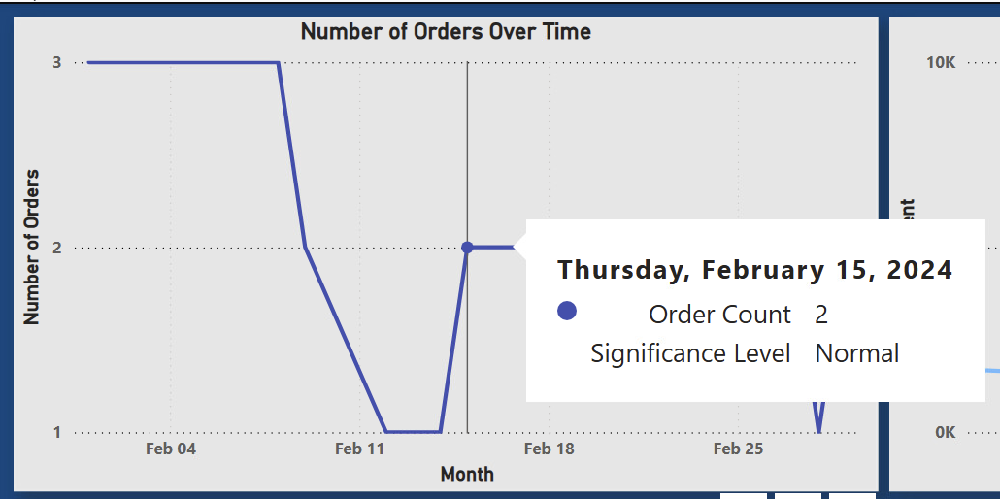
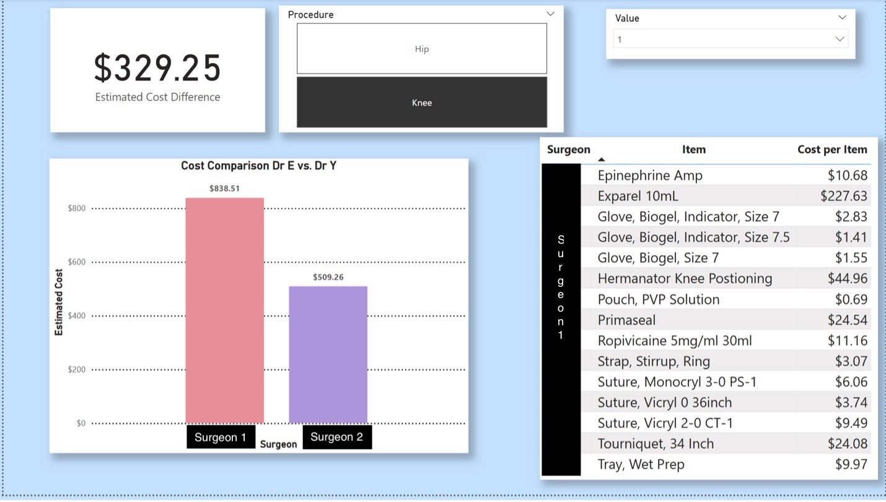

## Ordering Data Dashboard Creation

  

The hospital provided one large excel file with several worksheets in it related to supplier data. This data was uploaded into Power BI for the majority of the data cleaning and exploration 
process. Overall, the data was very clean and required little editing. To create the desired visuals in PowerBI, several new variables were created. 

## Variable Creation and Management 🌸

Below is a table of the newly created variables in PowerBI along with the DAX code used to create them. 

  

  

## Start Page 🏁

  

 Dashboard Start Page with Privacy Edits 

The first page of the dashboard tool is designed to be a general summary page of the most recent ordering data. The goal of this page was to answer the most commonly asked questions the materials manager faced on a daily basis, such as: when was the last order placed, has the last order been delivered, and how much have we spent this month? Because the center is also looking into how their money is spent at each supplier, so this page features a chart to breakdwon the monthly spend by the three avaialble suppliers. The fetaures of this page include: 

*  Cards for **Last Order Date**, **Status of Last Order**, **Total Spend this Month**, and **Total Orders this Month**. These cards are designed to answer ordering questions at a quick glance
*  Bar chart for **Monthly Spend by Supplier** to track how much money is being spent with each supplier
*  Bar chart for **Monthly Spead by Year** to compare this year's ordering costs with last year's
*  **Last Five Order Table** to display a concise view of the last five placed order at the faciltiy, showing the supplier, date ordered, PO, and order cost. This visual has a drillthrough option that can take you to the complete order details by PO, which can display every item purchased in the order, the item quantity, and the amount spent
*  Links to the three supplier login pages, displayed as the three supplier logos at the bottom of the page

## Order Date Page 📆
---
This page contains visuals for number of orders over time, total spent per order over time, average order size by month, and count of orders per day of week. It has a slicer option to filter 
the visual by month or year. 

  

The Order Date page without filters 

  

The Order Date page with a filter for Feb 

**Significance Testing 🏁**

Because the hospital was curious about if there were any trends in the ordering where there were days with a significant amount of spending or a significant amount of orders being placed. 
If the tool flagged a day as beign significant, the hospital could go back and investigate what took place that would cause a signifcant uptick in spending or ordering. Testing was done 
using two different methods: 

* **Z Scores**: the Z Score method was used to determine if there were any days that had a s significant number of orders compared to the average. The average and standard deviation were
  calculated to accomplish this. After Z scores were calculated using the DAX code to create the Z Score formula, the threshold of 2 was set and the signifance was applied to a tool tip
  feature that will display is the significance level was normal or not.

* **IQR Method**: the IQR method was used to test for outlier days with significant spending. The Q1 and Q3 were both calculated, and then used to calculate the interquartile range. Days
  outside of this range were flagged as outliers by a measure created in DAX code. This feature was also applied to a tool tip that would display if it was significant or not.

Testing accuracy was double checked using excel. 

  

Order Count Visual with tooltip 

  

Total Spent Visual with tooltip 

⭐️ **Order Page Insights** ⭐️

*  The number of order date visual shows the number of orders per day over time and is configured to show the days that have a significantly more orders than average. Currently, none of the days shown in the visual are flagged as significant. Based on the data, it is believed that only days with 4 orders in one day would be flagged as signifcant, because this would mean two orders had been placed from the same supplier.
*  The money spent by order date visual is configured to highlight outlier days for increases in spending. It highlighted several days, including one August 23rd of 2024 that was the most money spent on a supplier order in one day, at $11,681.20. Inside information from working at the company explains this as the day the air conditioning went out in the faciltiy, causing indoor temperature to rise outside the acceptable limits for many sterile supplies, causing a mass reorder of items
*  The category of item “supply” is the most ordered item.
*  The most items were ordered in August of 2024, for the reasons explained above. The fewest items were ordered in December, possibly because there was a record low number of surgeries that month due to the holidays and surgeons being out of town. 
*   The highest volume of orders was placed on Thursdays 

## Supplier Page 🗂️
---
This page contains a breakdown of the data related to the three suppleirs utilized by the hospital. The hospital was espeically interested in comparing the prices of items from multiple 
suppliers. While it might sometimes be necessary due to order an item from a suppleir regardless of price due to availabiltiy, the hsopital would like to try and always purchase items 
from the supplier with the lowest price. They were also interested in seeing what category of items are ordered from which suppliers and total spent over time. 

  

Unfiltered Supplier Page 

This supplier page can also be filtered down by supplier. 

  

Filtered Supplier Page 

⭐️ **Supplier Page Insights** ⭐️

*  The category of items “packs” is cheapest from Supplier 3
*  The “medication” category of items is most often cheapest from Supplier 2, which is also the only supplier the center can order narcotics from. Since most medications are cheapest from Supplier 2 and they provide the center's naroctics, it should be safe to switch it as the exclusive medication supplier.
*  There are large spikes for Supplier 2 in the visual showing money spent over time per supplier, further exploration into the data revealed that these orders are the ones where the medication Exparel as purchased, a famously expensive medication.
*  According to the data Supplier 2 is the supplier we have used the longest

## Procedure Estimation Page 💵
---
A large portion of this project was focused on estimating the item and numbers of items needed for a given surgery for a specific surgeon. This was the main goal to assist in inventory
management for the hopsital staff and this page can display the needed supplies and their quantity for weekly ordering. The page is capable of being filtered by surgeon and procedure,
as several of the surgeons perform more than type of procedure. Addtionally, this page can display the estimated supply cost for the hospital. This page also displays the top five most 
expensive items ordered for each surgeon. 

  

 Surgeon page filter by surgeon 4 and shoulder 

This page has been formatted to display a table that shows the needed items, their quantity, their category, their price, and the last order date for the item. Conditional formatting 
was applied to the order date column so that items ordered within the last 30 days would green, the last 60 would be yellow, and anything beyond 60 would be red. This is just to 
highlight any potential items that may need to be followed up on to ensure adequate inventory levels. 

  

 Surgeon page filter by surgeon 4 and spine 

⭐️ **Procedure Estimation Page Insights** ⭐️

*  Surgeon 4 shoulder procedure’s cost the most in terms of supplies
*  The medication Exparel is a common item in the more expensive surgeries 
*  Surgeon 2 and Surgeon 1 both perform total hip and total knee replacements, but Surgeon 2's knee is $325.28 cheaper than Surgeon 1's and his hips are $95.31 cheaper. Again, Surgeon 1 uses Exparel and Surgeon 2 does not, adding around $230 to his cases. 
•	Surgeon 1 also uses more items in his cases than Surgeon 2 does. 

## Surgeon Comparison Page 💭
---

After the creation of the Procedure Estimation Page, Surgeons 1 and 2 wanted to further explore why there was such a large price difference between their total hips and knees. While the use of Exaprel does explain a good porition of this price difference, the surgeons also take difference approaches into doing their procedures, causing addtional differences in items used and cost. So the Surgeon Comparison Page was created. 

  

  

The page displays a card that shows the price difference between the two surgeons as well as a tbale that lists the items differences between them. Specifically, the table displays the items that Surgeon 1 uses that Surgeon 2 does not. It also features a bar chart to show the price difference in a more visual manner, and there is a splicer that can filter the cost by number of surgeries. 

✨ Thank you for taking the time to check out my project ✨
